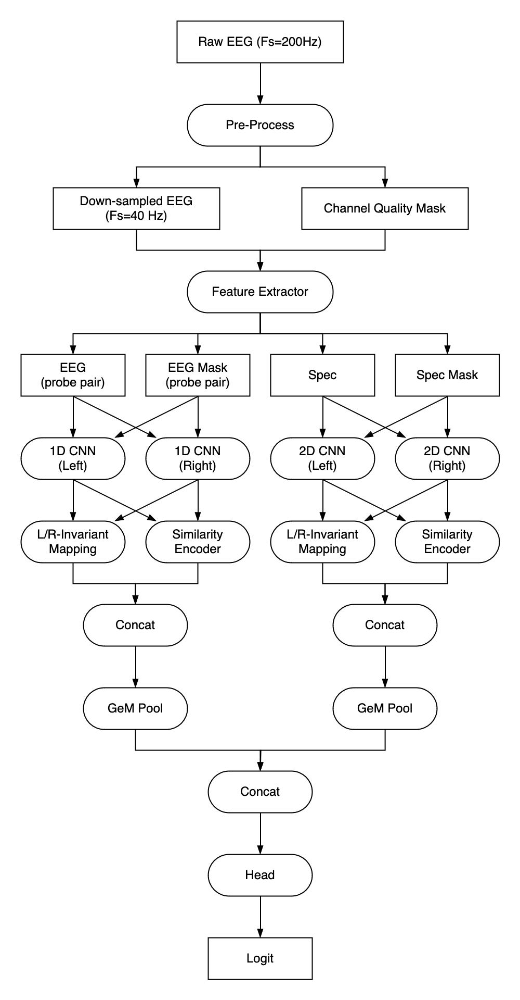

# 2024/03/22 Team Meeting

## 議題

1. 自己紹介
2. チームへの情報共有
    - コンペデータについての特筆すべき知見
    - 現状の解法について
    - チームに展開できそうな知見・リソース
4. 残りの時間で取り組みたいこと
5. 現状遭遇している問題について
6. その他運用について
    - ensemble seedのリリース手順について

<!--
## 自己紹介

* 「専業」Kagger暦2年9ヶ月。元はEC系、電子マネー系のベンチャー企業でSD→インフラエンジニアをしていた。
* 機械学習はAndrew Ngのコースから入った（Ariyasuさんのネット上の対談記事で知った）
* 影響を受けたKaggler
    - [K_mat](https://www.kaggle.com/kmat2019) -> モデリングの師匠だと勝手に思っている
    - [Jack(Japan)](https://www.kaggle.com/rsakata) -> 軽量なモデルで普通に金圏の強さ
* Kaggleのモチベーション
    - 勝ち負け < 探求
        - 目標は「誰も作らなかった解法でソロ優勝すること」
        - 逆に勝つために必要な作業がおそろかになってることがあると今回のチームマージで気付かされた
-->

## チームへの情報共有

### コンペデータについての特筆すべき知見

1. trainは2つのデータソースに分かれている（noisy/clean）。かつ、testではcleanの割合が多いっぽい。
    - noisy/cleanの割合
        - noisy: 62.6% <- 2/3はnoisy
        - clean: 37.3%
    - noisyの方が割合としては多いので、最初の数epoch全データで学習した方が最初からcleanのみで学習するよりCV/LBが下がるのはそのあたりが原因かも。
1. 実はほとんどの時系列ラベルは意味をなしていない
    - eeg_idのうち89%は1種類のラベルvoteの組み合わせしかない。
    - 議論: MIL(Multi-Instance Leaning)的な要因が鍵になる？
        - 現状、チームのこれまでの実験結果を聴く限りは、そこまで問題になってなさそう。

Reference

- [ラベル品質についてのEDA](https://github.com/bilzard/kaggle-hms-bilzard/blob/main/notebook/eda_label_quality.ipynb)

### 現状の解法

1. L/Rの左右差を特に意識したモデリング
    - L/Rのchannelごとの特徴を独立して1d/2d encoderで処理し、GeM poolでlate fusion
    - L/Rのembeddingのsimilarityの特徴が良く効いている
        - 左右差の情報はLateral/Generalのの判定に有効なためと理解している
2. Channelのqualityを評価して特徴として用いている
    - 最初EDAでEEGの生データを見た時、「めっちゃ汚い」と思った。劣化channelの問題はEEGの信号処理で問題になっているらしく、この部分をうまくモデリングできたら強いのでは？と思い追加した。
        - 例えば、電位差のグラフで「同じパターンが反転していて現れていたらnoise」みたいな診断を専門家がしているが、そもそもnoiseのないデータならこのような判別を人間が見てやる必要がなくなるので、機械学習モデルが処理する時も有効なのでは？と思った。
    - LQF(Local Quality Factor)というstaticなchannel品質の評価方法を提案した論文の手法を時系列に拡張した
    - 2Dのablation studyの結果では-0.007程度のpositiveな寄与が得られた

Reference

- [Slackに貼った解法概要](https://hms-dsj3699.slack.com/archives/C06PLJASCD7/p1710945240116909)
- [Ablation studyの結果](https://github.com/bilzard/kaggle-hms-bilzard/blob/main/note/004_ablation_study_of_2d_models.md)

### チームに展開できそうな知見・リソース

1. CQM(Channel Quality Mask)使ってみても良いかも
1. ナイキストの定理により、理論的にはfmaxの2倍のサンプリング周波数を取れば十分（情報を失うことなくdown sampleできる）-> 1Dではこの方法で学習・推論時間を短縮できる
    - 例) fmax=20 Hzの場合、40Hz(1/5)にdownsampleして良い

## 残りの時間で取り組みたいこと

### 1. 異なる filter bank

現状のチームの多様性はSTFTのパラメータと2Dエンコーダのモデルのアーキテクチャの多様性に偏っている。

→異なる方式の特徴抽出を探っていけば多様性が生まれるのでは？

かつ、過去のコンペやpublicで上がってない手法であれば競合チーム（chris, DD, Rist, PFN etc.）と差をつけられれると考えている。

STFT以外のfilter bank
- Wavegram[1]: SED(Sound Event Detection)系のタスクで生まれた手法。 Convによりlearnableなfilter bankを抽出し、2Dモデルでencode
- PANNs[1] (Spec + Wavegram)
- SincNet[2]: STFTのfilterが固定の周波数帯に対応するのに対し、IRフィルタのlow/highを学習可能なパラメータとしてモデルに組み込むことで、データの特性に特化したfilterを学習できるのでは？というコンセプトの手法。話者認識タスク(Speacker Detection)で少ない学習時間でconvによるfilter bankと同等の性能を示したことが報告されている。

WavegramはG2Netの2位解法でも使われている。
https://www.kaggle.com/competitions/g2net-gravitational-wave-detection/discussion/275341

なお、G2NetではSTFTとともにCQTが使われたっぽいが、同系列の手法であるCQTを公開したチームがあまり上位に来てないことから、「EEGではそんなに有望でない？」と勝手に思っている（とはいえ、試す価値はある）。
https://www.kaggle.com/code/abebe9849/make-cwt-from-eeg-compare-3-types-of-images

現状の進捗

Wavegram/PANNs: すでにリソース作りかけている。bestには及ばないがそこそこの性能も出ている。もう少しチューニングして1Dベストと同等の性能まで持って行くのが当面の目標。

Reference

1. [PANNs: Large-Scale Pretrained Audio Neural Networks for Audio Pattern Recognition](https://arxiv.org/abs/1912.10211)
1. [Speaker Recognition from Raw Waveform with SincNet](https://arxiv.org/abs/1808.00158)

### 2. SSL(Semi-supervised Leaning)

noisy label(weight<0.3)をラベルなしデータとみなした場合、これを使って学習を正則化させる手法が既存でいくつか提案されている（擬似ラベル（Pseudo label）もこれ関連の手法の一種）。

- Mean Teacher[2]
- CoTeaching[3]
- FixMatch[4]

現状の進捗

中盤にMean Teacherは試したが、良い成果が得られなかった。
一方で、過去のSED系のコンペ[1]でMean Teacherで結構良いパフォーマンスを得られたと報告しているものがあったので、このnotebookを元に再度トライしたら良い成果が得られるのでは？と考えている。

Chris、DD, PFNチームとかがやってそう/やりそう。

Reference

1. https://www.kaggle.com/code/reppic/mean-teachers-find-more-birds/notebook
1. Mean teachers are better role models: Weight-averaged consistency targets improve
semi-supervised deep learning results
1. Co-teaching: Robust Training of Deep Neural Networks with Extremely Noisy Labels
1. FixMatch: Simplifying Semi-Supervised Learning with Consistency and Confidence

### その他

#### 優先度低めのタスク

1. down-sample rateを変えたモデルによるensemble -> アイデアのネタが切れたらやる
1. CQM生成処理のGPU化 -> 推論時間がオーバーしそうになったらやる

#### 具体案はないが有効そうな手段

1. 絶対電位を入力としたモデリング
    - Graph NN系のEEGはこれだったような
1. Transformerによる擬似GNN
    - Channel数が高々20程度なのでTransformerでGNNの代替ができるのでは？

## 現状遭遇している問題について

Slackで共有した問題（再度整理しなおしたもの）

1. weight<0.3のみPseudo labelを適用するとtrain/validのlossは劇的に改善する(-0.04)が、LBでは逆に悪化した（+0.02）
    - (仮説)
        1. testにnoisy sampleも一定数含まれていて、それらのパフォマンスが悪化している
        2. 単にバグか何かでリークさせてるだけ？
1. weight<0.3のbinary/softラベルのembeddingをモデルのheadの直前に入力すると、CVが同じくらい下がる
    - (仮説)
        - weight<0.3 or notの情報はデータソースごとの分布を効率的に学習するための重要な情報で、モデルに明示的に与えすぎるとリークを起こす
1. weightをaux targetとして学習す手法はわずかにCVで改善効果が得られた（-0.005）ので、入力データからもデータソースの情報はそれとなく推定できるっぽい。

-> ここの原因をちゃんと突き止めて対策打てればかなり優位な立場に立てそうだが、残りの期間を考えると他の確実にスコアが上がりそうなタスクをやる方が良いと考えている。したがってこの知見をチームに共有した状態で調査は一旦打ち切りたい。

https://hms-dsj3699.slack.com/archives/C06PLJASCD7/p1711009178830759

## その他運用について

### 1. ensemble seedのsubmit手順について

新しいensemble seedをteam用のensembleに組み込んで欲しい場合の手順。

手順

[bilzard側の手順]

1. training for submission
    1. model単体(5 fold x 3 seed)モデルを学習
1. local test
    1. local submit用のsource clone repoを更新
        - [[local] HMS: clone kagle-hms-bilzard repo](https://www.kaggle.com/code/tatamikenn/local-hms-clone-kagle-hms-bilzard-repo)
    1. local submit用のmodel datasetを更新
    1. local submit用のnotebookを実行 -> コケないことを確認
    1. (optional) local submit用のnotebookのsubmit
1. prepare for team submission
    1. team用のsource clone repoを更新
        - [[team] 誤デプロイ注意‼️ HMS: clone kagle-hms-bilzard repo](https://www.kaggle.com/code/tatamikenn/team-hms-clone-kagle-hms-bilzard-repo)
    1. team用のmodel datasetを更新
    1. 当該モデルのoof予測を生成(5fold x 3seed)し、ariyasuさんに共有（※）

[ariyasuさん側の手順]

1. ensemble weightの決定(melder mead)
2. team用のsubmit

議論

**1. OOF予測ファイルの管理について**

懸念点

- ariyasuさんの負担になってないか？
- slack上の受け渡しだと、取り違えが起こるような気がしている
    - ファイル名と実験名の対応の取り違え
    - 同じファイル名で異なるバージョンの重みの取り違え
        - そもそも実験ごとにファイル名が異なるので問題ない？

対応案

- OOF予測を管理する、team共有のgit repoを作る
    - 各自repoにpushした上でariyasuさんに依頼するようにする
        - [メリット] ファイルの取り違えは依然起こる可能性があるが、少なくとも「最新の原本がどれか？」は明確になる。
        - [デメリット] 手順を厳格化することで運用が煩雑になる？

**2. ensemble weightの計算&submitはariyasuさんがSPOFにならないか？**

- 特に各自自分の作業が忙しくなる終盤に「ariyasuさんが動けなくてsubmitできない」問題が起こるとやばい
- 全員、少なくとも複数人がリリースできるようにしておいた方が良い？
